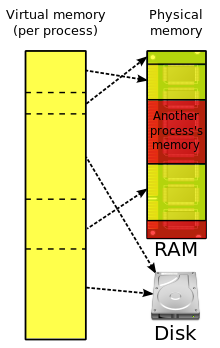
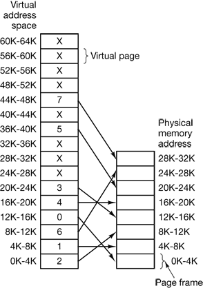

# 가상 메모리란 무엇인가요?

## 요약

가상메모리는 물리적인 메모리 **보다 큰 메모리 공간**을 사용하게 하는 것 처럼 보이는 기술입니다.

  
\*출처: http://www.oxygen-icons.org/

## 가상 주소와 물리 주소

- 프로세스에서 참조하는 주소를 **가상 주소(논리 주소)**라고 합니다.
- 메인 메모리에 있는 물리적인 실 주소를 **물리 주소**라고 합니다.
- 각 프로세스는 별도의 가상 주소 공간을 갖습니다.
- 프로세스가 가상 주소에 접근할 때마다 실제 주소로 변환하는데 이러한 작업을 **동적 주소 변환** 이라 하고, **메모리 관리 장치(Memory Management Unit)**이라는 하드웨어가 담당합니다.

## 가상 메모리의 장점

- 가상 메모리 기술은 프로세스의 모든 코드와 데이터를 메인 메모리로 로드하지 않고, 필요한 부분만 로드할 수 있어 메모리 활용도가 높습니다.
- 가상 메모리에 있는 연속적인 주소가 물리 주소에서는 연속적이지 않아도 됩니다. 때문에, 프로그래머는 메모리 배치에 관련해 신경쓸 필요가 없습니다.

## 블록 매핑

- 가상 메모리는 블록 단위로 묶어서 관리합니다.
- 블록 단위로 동적 주소 변환을 합니다.
- 컴퓨터 시스템은 동적 주소 변환에 대한 정보가 들어 있는 변환 맵을 가져야 합니다.

## 페이징

\*간단하게만 다룹니다.

- 블록이 고정 크기면 **페이지** 라고 하며 이를 이용한 가상 메모리 구성을 **페이징**이라 합니다.
- 페이징 시스템에서 가상 주소는 순서 쌍 (p, d)로 표현합니다.
  |페이지 번호 p|변위 d|
  |---|---|

  - p는 가상 메모리의 페이지를 의미합니다.
  - d는 페이지 안에서 참조하는 항목의 위치를 의미합니다.

- 페이지를 메인 메모리에 로드할때, 메인 메모리의 **페이지 프레임**이라는 블럭에 올라옵니다.

    
   \*출처 https://flylib.com/books/en/3.275.1.40/1/

- 프로세스가 메인 메모리에 없는 페이지를 참조할 때 프로세서는 **페이지 폴트**를 발생시키는데, 이는 인터럽트를 발생시켜 페이지를 메인 메모리로 로드하게 합니다.
