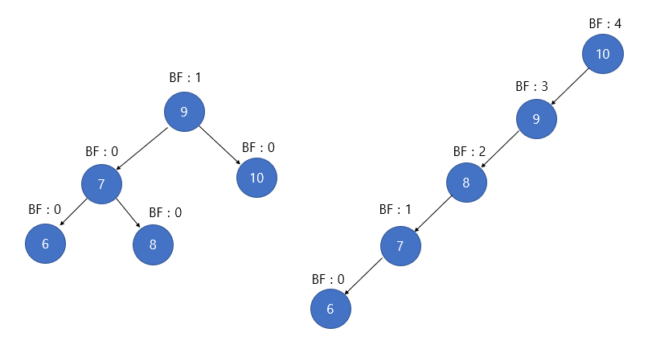

1. BBST란 : Balancced Binary Search Tree로 왼쪽 서브트리와 오른쪽 서브트리의 높이 차이가 1이하인 이진트리입니다.
- Red-black 트리와, AVL트리가 있습니다  

2. AVL 트리 : 각 노드의 서브트리 높이 차이는 최대 1이어야 합니다.
- 높이 차이가 1보다 커지는 것을 Rotation이라는 것을 통해 균형을 맞춥니다.
- 삽입, 검색, 삭제의 시간 복잡도가 logN 입니다. (N : Node수)
  
3. AVL트리의 Balance Factor
- Rotation하기 전에, AVL트리는 균형이 무너졌는지 판단할 때 Balance Factor를 이용합니다. 
- BF(K) = K의 왼쪽 서브트리의 높이 - K의 오른쪽 서브트리의 높이
- 

4. Rotation
- Right Rotation : 한 노드의 오른쪽 서브트리의 오른쪽 서브트리에 노드가 삽입되어 오른쪽 자식의 오른쪽에 불균형이 발생한경우 왼쪽으로 회전하여 균형을 맞춥니다. 
- Left Rotation : 한 노드의 왼쪽 서브트리의 왼쪽 서브트리에 노드가 삽입되어 왼쪽 자식의 왼쪽에 불균형이 발생한 경우 오른쪽으로 한 번 회전하여 균형을 맞춥니다.

6. 삽입 및 삭제:
- 삽입 : 일반적인 이진 검색 트리 규칙에 따라 위치를 찾아 삽입합니다. 삽입된 이후에는 루트 노드 방향으로 놀라가면서 걱 노드의 균형 인수를 확인합니다.  
만약 균형 인수가 -1, 0, 1이 아니라면 균형이 깨진 것이므로 회전 연산을 수행합니다.
  
- 삭제 : 삭제할 노드가 두 개의 자식을 가진 경우 대체 노드를 찾아 삭제하고, 대체 노드의 값을 삭제할 노드로 복사한 뒤 대체 노드를 삭제합니다.  
대체 노드의 값은 삭제할 노드의 오른쪽 서브트리에서 가장 작은 값과 왼쪽 서브트리에서 가장 큰 값일 수 있습니다.
  
7. Red-Black Tree
- AVL트리처럼 엄격하지는 않고 좀 더 유연한 균형 유지 방식을 사용합니다. 그리고 아래와 같은 특징이 있습니다.
- 각 노드는 레드 혹은 블랙의 색을 갖습니다.
- 루트 노드는 항상 블랙, 각 리프 노드는 블랙
- 레드 노드의 두 자식은 모두 블랙 (레드 노드는 연속해서 나타날 수 없습니다.)
- 어떤 노드에서 시작되어 해당 노드의 하위 리프에 도달하는 모든 경로에는 동일한 블랙노드가 있어야합니다(블랙 높이)