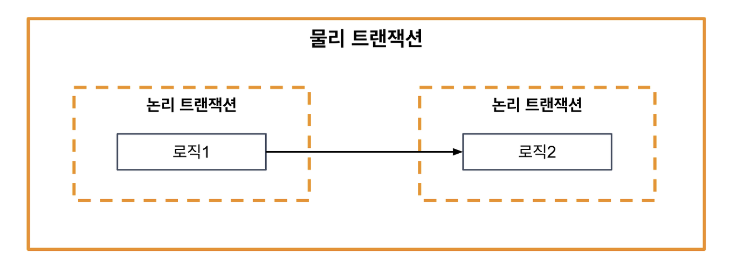

jpa는 EntityManager를 사용해 트랜잭션을 처리합니다. 트랜잭션 전파는 트랜잭션처리중에 어떻게 동작할지를 결정하는 거라고 보시면 됩니다.

트랜잭션은 시작, 커밋, 롤백 등으로 나뉘며 EntityManager의 getTransaction()을 이용해 EntityTransaction객체를 얻고, begin()을 이용해 시작합니다.  
트랜잭션을 완료하면 commit()하고, 문제가 발생하면 rollback()합니다.

@Transactional이라는 어노테이션에 다양한 옵션을 붙이면서 트랜잭션의 동작방식을 달리할 수 있습니다.

```java
@Transactional(propagation = Propagation.REQUIRED)
public void outerMethod(){
        // 어떤 로직 수행
        innerMethod(); // 내부 메소드 호출
        }

@Transactional(propagation = Propagation.REQUIRES_NEW)
public void innerMethod(){
        // 다른 트랜잭션에서 수행되는 로직
        }
```  
  
스프링에서는 이렇게 어노테이션으로 선언적 트랜잭션 경계를 만듭니다.  
이때 작업을 하다가 트랜잭션이 진행중일 때 추가적인 트랜잭션을 진행해야하는 경우에 어떻게 할지 결정하는 것이 전파 속성이며 7가지를 지원합니다.  

추가적으로 DB에서 제공하는 트랜잭션은 물리트랜잭션이고 스프링은 트랜잭션 매니저를 통해 여러곳의 트랜잭션을 처리할 수 있기 때문에 논리 트랜잭션이라는 개념을 사용합니다.  



물리 트랜잭션이 실제 DB에 적용되는 커밋롤백 단위라면, 논리 트랜잭션은 스프링의 트랜잭션매니저를 통해 처리하는 단위입니다.  
그래서 모든 논리트랜잭션이 커밋되어야 물리트랜잭션이 커밋, 하나라도 롤백되면 물리도 롤백이라는 원칙을 세울 수 있습니다.  


1. @Transactional(propagation = Propagation.REQUIRED)

- 해당 메서드를 호출한 곳에서 별도의 트랜잭션이 설정되어있지 않았다면 트랜잭션을 새로 시작합니다. 호출한 곳에서 이미 트랜잭션이 설정되어있다면 기존의 트랜잭션내에서 로직을 실행합니다. (기본값)
  메서드가 호출한 곳과 별도의 쓰레드라면 무조건 별도의 트랜잭션을 생성합니다.  
  Spring은 내부적으로 트랜잭션정보를 ThreadLocal변수에 저장하기 때문에 다른 스레드로 트랜잭션이 전파되지 않습니다.

2. @Transactional(propagation = Propagation.REQUIRES_NEW)
   매번 새로운 트랜잭션을 시작합니다. 만약 호출한 곳에서 이미 트랜잭션이 되어있다면 기존의 메서드가 종료할 때까지 대기하고 자신의 트랜잭션을 실행합니다.  
   새로운 트랜잭션 안에서 롤백이 발생해도 전파되지 않습니다. (완전히 별개입니다.)

3. @Transactional(propagation = Propagation.NESTED)
   기본적으로 디폴트인 REQUIRED와 동일하게 작동하지만, savepoint 를 지정한 부분까지 부분롤백이 가능합니다.   
   단, 오라클처럼 savepoint를 지원해야 사용이 가능합니다.
   
JPA를 사용할때도 트랜잭션 A가 값을 변경하고 커밋하지 않은 상태에서 트랜잭션 B가 같은 값을 읽을 때 Dirty Read가 발생할 수 있습니다.  
이때 트랜잭션 A가 롤백된다면 결국 잘못된 값을 읽는 것이 됩니다.
또한 A가 값을 계속 읽지만, 그 사이에 트랜잭션 B가 값을 바꾸면 NonRepeatableRead가 발생할 수 있습니다.  
마찬가지로, A가 범위값을 읽는데 그 사이에 트랜잭션 B가 테이블에 값을 추가하면 팬텀read가 발생할 수 있습니다.  
