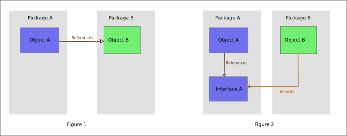

# SOLID 원칙이 뭔지 설명해주세요

## 개요

- SOLID 원칙은 객체지향 프로그래밍의 5대 원칙입니다.
- 5대원칙으로는 SRP, OCP, LSP, ISP, DIP가 있습니다.

## SRP - Single Responsibility Principle

- SRP는 **단일 책임 원칙**으로, 하나의 클래스가 하나의 엑터에 대한 책임만 당담해야 한다는 원칙입니다.
    - 여기서 엑터는 클래스 변경이 필요한 그룹으로, 외부 서비스나 이해관계자, 유저 등이 포함될 수 있습니다.
    - *원래 Responsibility가 아니라 Reason이였는데, 모호한 용어라고 해서 Responsibility라고 했다고 하네욤! 차라리 Single Actor Re.. Pri..이 낫지 않았을까*
- 클래스가 여러 엑터에 대한 책임을 담당하게 되면 수정사항이 생겼을 때, 변경해야 하는 클래스를 특정하기 어렵고 다른 책임을 침범하는 일이 생길 수 있기 때문입니다.

## OCP - Open-Closed Principle

- OCP는 **개방 폐쇠 원칙**으로 확장에는 열려있고 수정에는 닫혀있어야 한다는 원칙입니다.
- **확장에 열려있다**의 의미는 요구사항이 변경될때 새로운 동작을 추가해 애플리케이션의 기능을 확장할 수 있다라는 의미이고,
- **수정에 닫혀있다**는 의미는 기존의 코드를 수정하지 않아도 애플리케이션의 동작을 추가하거나 변경할 수 있다는 의미입니다.
- 추상화를 통해 이를 달성할 수 있습니다. 
    - 기존 코드가 추상 클래스나 인터페이스에 의존하게 되면,
    - 구현 클래스를 만들어서 동작을 추가할 수 있어 **확장에 열려있고**,
    - 기존 코드를 수정하지 않아도 되기 때문에 **수정에 닫혀있습니다**

## ISP - Interface segregation principle

- ISP는 **인터페이스 분리 원칙**으로 큰 인터페이스를 구체적인 작은 인터페이스로 분리해서 클라이언트에서 진짜 사용하는 메서드만 제공해줘야 한다는 원칙입니다.

## LSP - Liskov Substitution Principle

- LSP는 **리스코프 치환 원칙**으로 하위 타입이 상위 타입을 호환할 수 있어야 한다는 원칙입니다.
- 이 원칙을 준수하기 위해선 하위 타입이 상위 타입의 기능을 모두 지원해야 하며, 원래 기능과 다른 동작을 하지 말아야 합니다.

## DIP - Dependency Inversion Principle

- DIP는 **의존관계 역전 원칙**으로 고수준 모듈이 저수준 모듈의 구현에 의존하지 않고 둘다 인터페이스와 같은 추상화에 의존해야 한다는 원칙입니다.
- 고수준 모듈은 프로그램 진입점과 가까운 모듈을 의미하고, 저수준 모듈은 프로그램 진입점과 먼 모듈을 의미합니다.
- **역전**의 의미는 저수준 모듈이 고수준 모듈을 직접적으로 의존한다는 의미가 아니라, 고수준 레이어의 추상화를 의존한다는 의미입니다. (아래와 같이)
- 